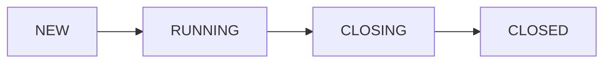
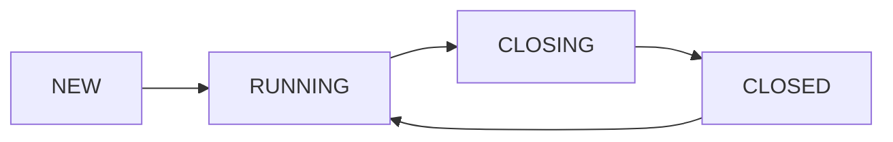
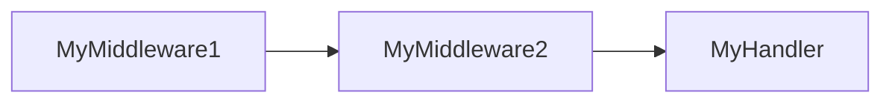
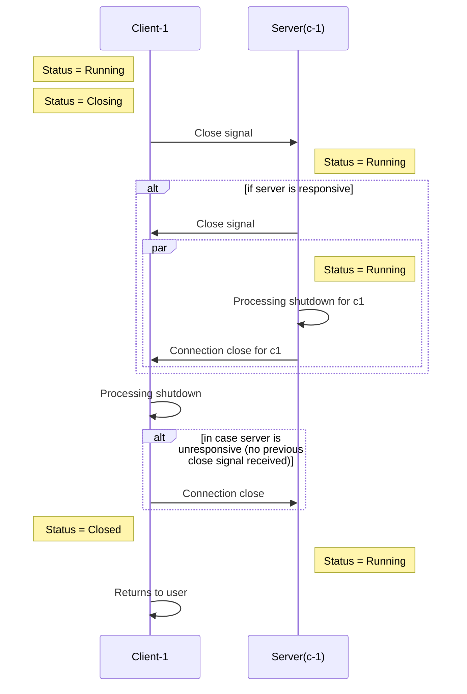
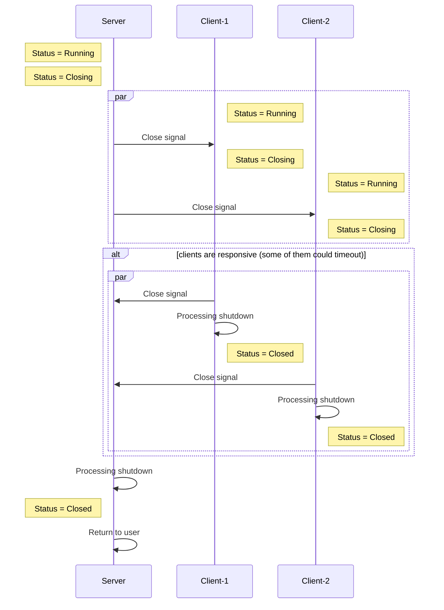

# Goomerang

A [protocol buffers](https://developers.google.com/protocol-buffers/) over [websocket](https://datatracker.ietf.org/doc/html/rfc6455)
communications library.
<p align="center">

</p>

## Motivation

Goomerang is an effort to provide an easy, application friendly way of communicating clients and servers. Because some of us only need to
send some protos over a fast pipe.


Possible status transitions for servers:



Possible status transitions for clients:



## Main features

* Simple, modular, embeddable. Use only the parts of interest. Have full control over the dependency.
* Websockets as underlying transport (currently built on top of [gorilla/websocket](https://github.com/gorilla/websocket)).
* [Protocol buffers](https://developers.google.com/protocol-buffers/) as first class citizen. Register [message handlers](#message-handlers)
  at clients and
  servers.
* [Middleware support](#middlewares), based on the Go HTTP standard lib.
* [Broadcast messages](#broadcasts) from the server to clients.
* Send [synchronous messages](#synchronous-sends) from the client side, following a request/response pattern.
* Support for concurrency at a message handler level.
* Support for configurable [hooks](#hooks) for certain actions.
* [Graceful shutdown](#graceful-shutdown) of the websocket connection/processing.
* [Ping/pong](https://datatracker.ietf.org/doc/html/rfc6455#section-5.5.2) messages out of the box in clients and server. Keep alive
  connections.
* Customizable TLS configuration.
* Custom errors are exposed, ability to build retry systems on top of the public API.
* Optional [Prometheus metrics](#prometheus-metrics), that will help to instrument clients and servers.

## Installation

An installation on any Go project can be done by:

```bash
go get go.eloylp.dev/goomerang
```

## Basic usage

Let's create a basic server. We just need to import the server package from the library. The server has many options
available, we encourage the user to review them [here](server/opts.go).

```go
package main

import (
	"log"

	"go.eloylp.dev/goomerang/server"
)

func main() {
	s, err := server.New(
		server.WithListenAddr("127.0.0.1:8080"),
	)
	if err != nil {
		log.Fatal(err)
	}
	if err := s.Run(); err != nil { // Will block the program till exit.
		log.Fatal(err)
	}
	//...
}
```

The client side package its quite symmetric with the server one. The client also has many configurable options, see
them [here](client/opts.go).
Lets see a client example:

```go
package main

import (
	"context"
	"log"

	"go.eloylp.dev/goomerang/client"
)

func main() {
	//...
	c, err := client.New(
		client.WithServerAddr("127.0.0.1:8080"),
	)
	if err != nil {
		log.Fatal(err)
	}
	if err := c.Connect(context.Background()); err != nil {
		log.Fatal(err)
	}
	//...
}
```

That's it ! we just have connected a client and a server ! But not in a very
useful way. Both, client and server have support for handlers. See the next sections for more information.

## Messages

Goomerang facilitates the creation of custom protocols for messages. Messages can have 2 parts, `headers` and a `payload`. Headers are just
a key/value map of type string/string. The payload allows holding
any type
which accomplishes the [proto.Message](https://github.com/protocolbuffers/protobuf-go/blob/v1.28.0/proto/proto.go#L24) interface, so any
protocol buffer message.

```go
package main

import (
	"go.eloylp.dev/goomerang/message"

	"myapp/protos"
)

func main() {
	msg := message.New().
		SetHeader("status", "requested").
		SetPayload(&protos.MyMessageV1{})
}
```

The message type it's normally used in handlers. It can also be used
in the public API of client and server instances for simple operations like `Send(msg)`. See more in the following documentation.

## A history of handlers and middlewares

There's support for handlers and middlewares for both, client and server sides. This part of the project comes inspired by the
Go [HTTP standard library](https://pkg.go.dev/net/http#HandlerFunc). Our hope is to make this part familiar and versatile.

Handlers and middlewares **can only be registered before starting** the client or server.

### Message Handlers

Let's see how to register a message handler.

```go
package main

import (
	"go.eloylp.dev/goomerang/message"
	"go.eloylp.dev/goomerang/server"
	"myapp/protos"
)

func main() {

	// Create the server
	s, _ := server.New(server.WithListenAddr("127.0.0.1:8080"))

	// protos.MyMessageV1 represents a hypothetical message in your proto repo.
	s.Handle(&protos.MyMessageV1{}, message.HandlerFunc(func(sender message.Sender, msg *message.Message) {
		// We need to cast the message, from the proto interface, to the concrete message type.
		msgT := msg.Payload.(*protos.MyMessageV1)

		// Do whatever with your message,
		// your handling logic goes here.

		// Alternatively, reply with another message.
		payload := &protos.MyReplyMsgV1{}
		reply := message.New().
			SetPayload(payload).
			SetHeader("status", "200")

		_, err := sender.Send(reply) // Replies to the client connection.
		// check for errors ...
	}))
}
```

Symmetrically, the same handler registering signature can be found at the client public API.

As handlers only need to accomplish the `message.Handler` interface, It's very common to use structs for holding handler dependencies,
which need to be thread safe:

```go
package main

import (
	"database/sql"

	"go.eloylp.dev/goomerang/message"
)

type MyHandler struct {
	DB *sql.DB
}

func (m *MyHandler) Handle(sender message.Sender, msg *message.Message) {
	// My handling logic goes there.
}
```

### Middlewares

Middlewares are just message handlers that always get executed no matter the kind of message, providing the ability to execute the next
handler in the chain. They are
being executed just before the message handler, bringing the opportunity to add extra logic to the message processing like metrics, logging
or panic handlers. Let's see how to register a middleware:

```go
package main

import (
	"fmt"

	"go.eloylp.dev/goomerang/message"
	"go.eloylp.dev/goomerang/server"
)

func main() {
	s, _ := server.New(server.WithListenAddr("127.0.0.1:8080"))
	s.Middleware(func(h message.Handler) message.Handler {
		return message.HandlerFunc(func(sender message.Sender, msg *message.Message) {
			fmt.Printf("received message of kind: %q", msg.Metadata.Type)
			h.Handle(sender, msg) // Continue with the next handler in chain.
		})
	})
}
```

That's sounds really familiar ! Yes, Goomerang tries to preserve same traits as the standard library. Again, the same symmetric interface
can be found in the client public API.

It's important to note that **any number of middlewares can be registered**. The **order of registration will drive the order of execution**
. So for example, if we had:

```go
package main

import (
	"go.eloylp.dev/goomerang/message"
	"go.eloylp.dev/goomerang/server"
)

func main() {
	s, _ := server.New(server.WithListenAddr("127.0.0.1:8080"))
	s.Handle(MyHandler())
	s.Middleware(MyMiddleware1())
	s.Middleware(MyMiddleware2())
}
```

The order of execution would be:



This library facilitates some middleware implementations [here](./middleware) that can be used directly. Let's see the example of the panic
handler one:

```go
package main

import (
	"fmt"

	"go.eloylp.dev/goomerang/message"
	"go.eloylp.dev/goomerang/middleware"
	"go.eloylp.dev/goomerang/server"
)

func main() {
	s, _ := server.New(server.WithListenAddr("127.0.0.1:8080"))
	s.Middleware(middleware.Panic(func(p interface{}) {
		fmt.Printf("panic detected: %v", p)
	}))
}
```

As a rule of thumb, we always recommend this middleware to be implemented as first in the chain (so it protects the rest of handlers), in
order to not crash the entire process if
a panic arises at some point in the handler chain.

## Broadcasts

From the server side perspective, it's possible to send messages to all connected clients. This can be useful for a number of cases, like
push notifications. Here's and example on how to do so:

```go
package main

import (
	"context"
	"log"

	"go.eloylp.dev/goomerang/message"
	"go.eloylp.dev/goomerang/server"
	"myapp/protos"
)

func main() {
	// Create the server
	s, _ := server.New(server.WithListenAddr("127.0.0.1:8080"))

	msg := message.New().SetPayload(&protos.MyMessageV1{})

	_, err := s.BroadCast(context.TODO(), msg)
	if err != nil {
		log.Fatal(err)
	}
}
```

From the client perspective, it is not possible to send broadcasts to all the other connected clients. However, nothing will stop the
developer to create a handler for enabling this operation:

```go
package main

import (
	"context"
	"log"

	"go.eloylp.dev/goomerang/message"
	"go.eloylp.dev/goomerang/server"
	"myapp/protos"
)

func main() {
	// Create the server
	s, _ := server.New(server.WithListenAddr("127.0.0.1:8080"))

	s.Handle(&protos.MyBroadCastV1{}, message.HandlerFunc(func(sender message.Sender, msg *message.Message) {

		broadcastMessage := msg.Payload.(*protos.MyBroadCastV1)

		// Calls to the server broadcast method, will use the global lock of the server,
		s.Broadcast(context.TODO(), broadcastMessage.Message)

	}))

	msg := message.New().SetPayload(&protos.MyBroadCastV1{
		Message: &protos.MyMessageV1{},
	})

	_, err := s.BroadCast(context.TODO(), msg)
	if err != nil {
		log.Fatal(err)
	}
}
```

## Synchronous sends

The default send methods `c.Send()` `s.Broadcast()` from client and server respectively, **are completely asynchronous**. They work as a "
fire
and forget" send system. They just write to the TCP socket send buffer. They are only going to block the call if the other peer stops ACKing
TCP
packets, and the pre-negotiated TCP window size is exceeded. That way the sender knows when to stop sending messages to the other peer,
until it starts performing more TCP acks.

The following command can give us minimum, default and maximum receive buffers size in bytes in a Linux machine.

```bash
$ cat /proc/sys/net/ipv4/tcp_rmem 
4096	131072	6291456
```

That means the user of the library should design a way to ensure the message was received and processed by the server before removing it
from its internal state. Unless of course, the intrinsic value of the data expires very quick, and the client can afford its lost.

Clients on this library have a `c.SyncSend(ctx, msg)` method implemented. This allows clients sending messages and wait for the server
reply.
Here is an example of its use:

```go
package main

import (
	"context"
	"log"

	"go.eloylp.dev/goomerang/client"
	"go.eloylp.dev/goomerang/message"
	"myapp/protos"
)

func main() {
	c, err := client.New(client.WithServerAddr("127.0.0.1:8080"))
	if err != nil {
		log.Fatal(err)
	}

	msg := message.New().SetPayload(&protos.MyMessageV1{})
	// Will block till reply from the server is received or
	// the context is cancelled.
	_, respProto, err := c.SendSync(context.TODO(), msg)
	if err != nil {
		log.Fatal(err)
	}

	if respProto.GetHeader("status") == "OK" {
		resp := respProto.Payload.(*protos.MySuccessReplyV1)
		// Do something with the success reply
		return
	}

	resp := respProto.Payload.(*protos.MyBadReplyV1)
	// Do something with the bad reply
}
```

This is just a high level request/response pattern built on the top of the "fire and forget"
previously commented send system. It probably can help some clients, when the reply is
crucial for completing the operation.

## Hooks

Sometimes getting feedback from internal parts of the system its difficult. Specially in processing loops, where in case of errors we cannot
return them to client, and we do not want to take decisions on their place. To deal with this,
in both parts (client and server) the user can register function hooks. A complete list of them can be found in the configuration options of
both, [client](client/opts.go) and [server](server/opts.go). Let's take a look on how to register an error hook:

```go
package main

import (
	"log"

	"go.eloylp.dev/goomerang/server"
)

func main() {
	s, _ := server.New(
		server.WithListenAddr("127.0.0.1:8080"),
		server.WithOnErrorHook(func(err error) {
			log.Printf("logging error: %v", err)
		}),
		server.WithOnErrorHook(func(err error) {
			// Do a second action with err.
		}),
	)
}
```

This error hooks are very handy to log errors, so the user can use best, customized loggers. All the hooks can be
registered multiple times. The logic behind will just execute the hooks in order.

## Graceful shutdown

The current implementation supports a graceful shutdown
as described
in [RFC6455](https://datatracker.ietf.org/doc/html/rfc6455#section-1.4). One side of the connections initiates the shutdown procedure,
signaling it's not going to send more messages and waiting for the same reply from the other peer. Once all processing logic (like handlers)
end, the library just returns the control to the user. This implementation works in a best-effort way, many things can go wrong in the
middle of the process. Users of the library are encouraged to not rely on this shutdown procedure regarding data integrity.

Let's see the shutdown process when a **client initiates** the shutdown procedure:



The server never changes its status, as the initiator of the shutdown was only one client. So only the "connection slot" and processing for
that client is removed from the server.

Let's check now the sequence when the **server initiates** the shutdown connection:



## Prometheus metrics


