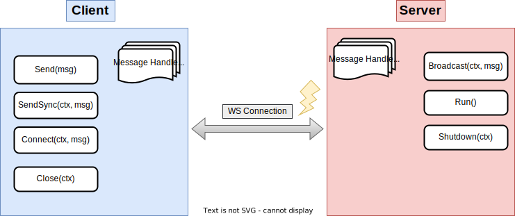
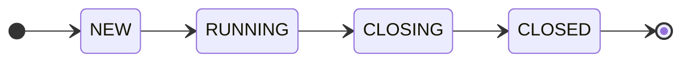
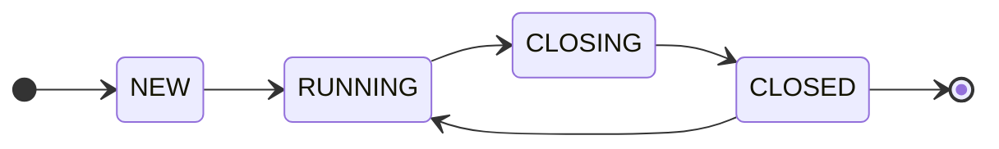
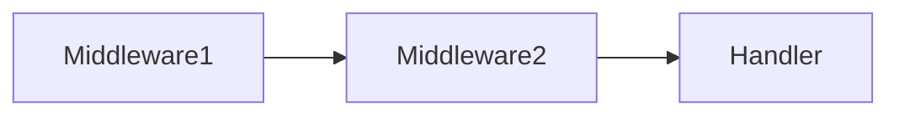
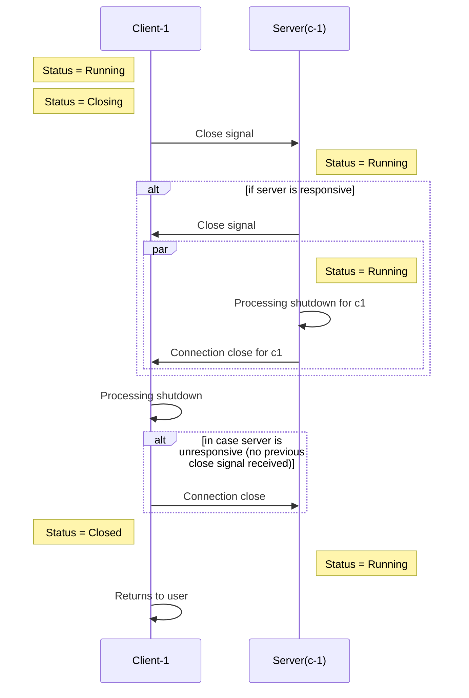
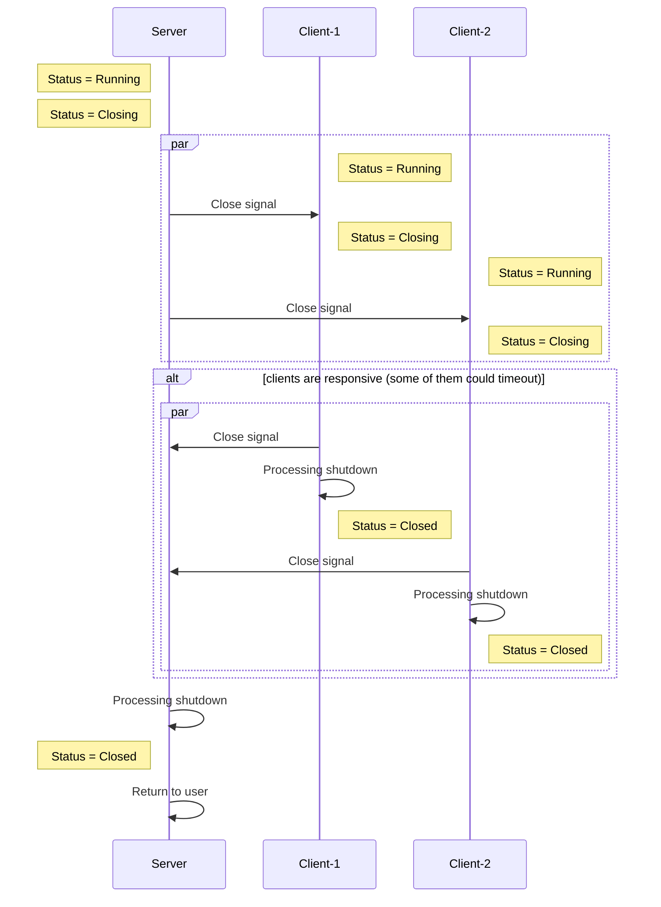
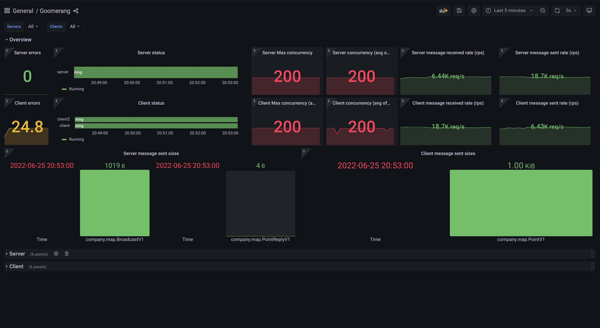

# Goomerang

A [protocol buffers](https://developers.google.com/protocol-buffers/) over [websocket](https://datatracker.ietf.org/doc/html/rfc6455)
communications library.
<br>
<br>
<p align="center">

</p>

<p align="center">
<a href="https://github.com/eloylp/goomerang/actions/workflows/ci.yml"></a>
<a href="https://goreportcard.com/report/go.eloylp.dev/goomerang"></a>
<a href="https://godoc.org/go.eloylp.dev/goomerang"></a>
</p>

<p align="right" style="color:silver">
Gopher art by <a href="https://github.com/lidiackr">@lidiackr</a>
</p>

## Status

This project is still a proof of concept. It has none or very little production experience. Maintainers of the project reserve the right of
breaking the public API in new versions.

## Motivation

Goomerang is an effort to provide an easy, application friendly way for communicating clients and servers. Because some of us only need to
send some protos over a fast pipe.



Possible status transitions for servers:



Possible status transitions for clients:



## Main features

* Simple, modular, embeddable. Use only what you need and keep control of your dependencies.
* Websockets as underlying transport (currently built on top of [gorilla/websocket](https://github.com/gorilla/websocket)).
* [Protocol buffers](https://developers.google.com/protocol-buffers/) as first class citizens. Register [message handlers](#message-handlers) at clients and servers.
* [Middleware support](#middlewares), inspired by the Go HTTP standard lib.
* [Broadcast messages](#broadcasts) from the server to clients.
* Send [synchronous messages](#synchronous-sends) from the client side, following a request/response pattern.
* Support for concurrency at the message handler level.
* Support for configurable [hooks](#hooks) for certain actions.
* [Graceful shutdown](#graceful-shutdown) of the websocket connection/processing.
* [Ping/pong](https://datatracker.ietf.org/doc/html/rfc6455#section-5.5.2) messages out of the box in clients and server. Keep alive connections.
* Customizable TLS configuration.
* Custom errors are exposed, allowing you to build retry systems on top of the public API.
* [Observability tools](#observability), that will help you instrument clients and servers.

## Installation

```bash
go get go.eloylp.dev/goomerang
```

## Basic usage

If you are unfamiliar with protocol buffers, all the examples on this readme plus a little guide can be
found [here](example/protos/README.md).

Let's create a basic server. You just need to import the server package from the library and instantiate a new server. There are a variety of extra config options for the server that you can explore [here](server/opts.go) at your own pace. Defaults are set [hete](server/config.go) for some of those options.

```go
package main

import (
	"log"

	"go.eloylp.dev/goomerang/server"
)

func main() {
	s, err := server.New()
	if err != nil {
		log.Fatal(err)
	}
	if err := s.Run(); err != nil { // Will block the program till exit.
		log.Fatal(err)
	}
	//...
}
```

The client side package its pretty similar to the server one. There are also a variety of config options that you can explore further [here](client/opts.go). Let's go over another example. In this case passing the address as one of the available options when creating the client:

```go
package main

import (
	"context"
	"log"

	"go.eloylp.dev/goomerang/client"
)

func main() {
	//...
	c, err := client.New(
		client.WithServerAddr("127.0.0.1:8080"),
	)
	if err != nil {
		log.Fatal(err)
	}
	if err := c.Connect(context.TODO()); err != nil {
		log.Fatal(err)
	}
	//...
}
```

That's it! You've connected your client and your server and now the fun begins. Let's dive into the world of messages and handlers and put those connections to use.

## Messages

Goomerang facilitates the creation of custom message protocols. Messages can have two parts, `headers` and a `payload`. Headers are just
a `map[string]string`. The payload allows holding any type which satisfies
the [proto.Message](https://github.com/protocolbuffers/protobuf-go/blob/v1.28.0/proto/proto.go#L24) interface, so any protocol buffer
message type.

```go
package main

import (
	"go.eloylp.dev/goomerang/message"

	"go.eloylp.dev/goomerang/example/protos"
)

func main() {
	msg := message.New().
		SetHeader("I am a key", "I am a value").
		SetPayload(&protos.MessageV1{
			Message: "Woop! Woop!",
		})
}
```

The easiest way around messages is to use the message builder, as it'll abstract a lot of the underlying complexity of protos.

The `message.Message` type it's normally used in message handlers, but it can also be used
in the public API of client and server instances for simple operations like `Send(msg)`.

### Messages registration

Both clients and servers need to know about every message type beforehand, as they have to be able to handle them.

- Servers register message types using the [handler registration](#message-handlers) functions.
- Clients can register message types in one of these two ways. These are mutually exclusive, use one or the other:
	- Using the [handler registration](#message-handlers) functions, like the servers do.
    - Using `client.RegisterMessage(msg)` instead.


## Handlers and middlewares

At this point you have a connection and at least some type of messages registered. But now you want to interact with them and use them. You need handlers and middlewares to react to those messages. There's support for handlers and middlewares for both client and server sides. This part of the project is inspired by the
Go [HTTP standard library](https://pkg.go.dev/net/http#HandlerFunc). The goal is to make this part familiar and versatile.

Handlers and middlewares **can only be registered before starting** the client or the server.

### Message Handlers

Let's see how to register a message handler.

```go
package main

import (
	"go.eloylp.dev/goomerang/message"
	"go.eloylp.dev/goomerang/server"
	"go.eloylp.dev/goomerang/example/protos"
)

func main() {

	// Create the server
	s, _ := server.New(server.WithListenAddr("127.0.0.1:8080"))

	// protos.MessageV1 represents a hypothetical message in your proto repo.
	s.Handle(&protos.MessageV1{}, message.HandlerFunc(func(sender message.Sender, msg *message.Message) {
		// We need to cast the message, from the proto interface, to the concrete message type.
		msgT := msg.Payload.(*protos.MessageV1)

		// your handling logic goes here

		// Optionally, reply with another message.
		payload := &protos.ReplyV1{}
		reply := message.New().
			SetPayload(payload).
			SetHeader("status", "200")

		_, err := sender.Send(reply) // Replies to the client connection.
		// check for errors ...
	}))
}
```

Symmetrically, the same handler registering signature can be found at the client public API.

Because handlers only need to satisfy the `message.Handler` interface, it's very common to use structs for holding handler dependencies, which need to be thread safe:

```go
package main

import (
	"database/sql"

	"go.eloylp.dev/goomerang/message"
)

type Handler struct {
	DB *sql.DB
}

func (m *Handler) Handle(sender message.Sender, msg *message.Message) {
	//  handling logic goes there.
}
```

### Middlewares

Middlewares are just message handlers that always get executed no matter the kind of message. Optionally, they can also be chained together, so they execute the next message in the chain. They are executed just before the message handler, bringing the opportunity to add general preprocessing or postprocessing logic to the message handling operation like, for instance, metrics, logging or panic handlers. 

Let's see how to register a middleware:

```go
package main

import (
	"fmt"

	"go.eloylp.dev/goomerang/message"
	"go.eloylp.dev/goomerang/server"
)

func main() {
	s, _ := server.New(server.WithListenAddr("127.0.0.1:8080"))
	s.Middleware(func(h message.Handler) message.Handler {
		return message.HandlerFunc(func(sender message.Sender, msg *message.Message) {
			fmt.Printf("received message of kind: %q", msg.Metadata.Kind)
			h.Handle(sender, msg) // Continue with the next handler in chain.
		})
	})
}
```

That's sounds really familiar! Yes, Goomerang tries to preserve same aspects of the standard library. The same interface can be found in the client public API, keeping goomerang symmetric.

It's important to note that **any number of middlewares can be registered**. The **order of registration will drive the order of execution**. So, for example, if we had:

```go
package main

import (
	"go.eloylp.dev/goomerang/message"
	"go.eloylp.dev/goomerang/server"
)

func main() {
	s, _ := server.New(server.WithListenAddr("127.0.0.1:8080"))
	s.Handle(Handler())
	s.Middleware(Middleware1())
	s.Middleware(Middleware2())
}
```

The order of execution would be:



This library offers some predefined out-of-the-box middleware [implementations](middleware). Let's walk over the panic handler, for example:

```go
package main

import (
	"fmt"

	"go.eloylp.dev/goomerang/message"
	"go.eloylp.dev/goomerang/middleware"
	"go.eloylp.dev/goomerang/server"
)

func main() {
	s, _ := server.New(server.WithListenAddr("127.0.0.1:8080"))
	s.Middleware(middleware.Panic(func(p interface{}) {
		fmt.Printf("panic detected: %v", p)
	}))
}
```

Implementing the panic middleware as first in the chain, you can protect the rest of handlers avoiding crashing the entire process if a panic arises at some point in the handler chain.

## Broadcasts

The server can broadcast a message to all connected clients. This can be useful for cases like push notifications. 

Here's an example on how to do it:

```go
package main

import (
	"context"
	"log"

	"go.eloylp.dev/goomerang/message"
	"go.eloylp.dev/goomerang/server"
	"go.eloylp.dev/goomerang/example/protos"
)

func main() {
	// Create the server
	s, _ := server.New(server.WithListenAddr("127.0.0.1:8080"))

	msg := message.New().SetPayload(&protos.MessageV1{
		Message: "a message for everyone!"
	})

	_, err := s.BroadCast(context.TODO(), msg)
	if err != nil {
		log.Fatal(err)
	}
}
```


Clients can't broadcast to to all the other connected clients. There's a workaround though, by creating a handler for enabling this operation in the server. An example can be
found [here](client_side_broadcast_test.go).

## Synchronous sends

The default send methods `c.Send()` `s.Broadcast()` from client and server respectively, **are completely asynchronous**. They work as a "fire and forget" send system. That means you'll need to design a way to ensure the message was received and processed by
the server before removing it from its internal state. Unless of course, the intrinsic value of the data expires very quick and the client can afford this loss.

In response to this issue, clients on this library have a `c.SyncSend(ctx, msg)` method implemented. This allows clients to send messages and wait for the server response.

Here is an example of its use:

```go
package main

import (
	"context"
	"log"

	"go.eloylp.dev/goomerang/client"
	"go.eloylp.dev/goomerang/message"
	"go.eloylp.dev/goomerang/example/protos"
)

func main() {
	c, err := client.New(client.WithServerAddr("127.0.0.1:8080"))
	if err != nil {
		log.Fatal(err)
	}
	// The client needs to be aware of the response messages 
	// beforehand. 
	c.RegisterMessage(&protos.SuccessResponseV1{})
	c.RegisterMessage(&protos.BadResponseV1{})

	msg := message.New().SetPayload(&protos.MessageV1{})
	// Will block until response from the server is received or
	// the context is cancelled.
	_, respProto, err := c.SendSync(context.TODO(), msg)
	if err != nil {
		log.Fatal(err)
	}

	if respProto.GetHeader("status") != "OK" {
		resp := respProto.Payload.(*protos.BadResponseV1)
		// Do something with the bad response
		return
	}
	resp := respProto.Payload.(*protos.SuccessResponseV1)
	// Do something with the success response
}
```


This is just a high level request/response pattern built on the top of the "fire and forget" send system. It may be useful to some users in case the response is critical for completing the operation. Remember we are sharing the same pipe here, for all the messages.

### Some extra notes

Asynchronous methods just write to the TCP socket send buffer. They are only going to block the call if the other peer stops ACKing
TCP packets, so the pre-negotiated TCP window size is exceeded. That way the sender knows when to stop sending messages to the other peer,
until it starts performing more TCP acks again.

The following command can give us minimum, default and maximum receive buffers size in bytes in a Linux machine.

```bash
$ cat /proc/sys/net/ipv4/tcp_rmem 
4096	131072	6291456
```

## Hooks

Sometimes getting feedback from internal parts of the system can be difficult. Specially in processing loops, where in case of errors we cannot
return them to the user, and we do not want to make decisions on their place. To deal with this,
you can register function hooks both on the client or the server sides. A complete list of them can be found in the configuration options of
both, [client](client/opts.go) and [server](server/opts.go). 

Let's take a look on how to register an error hook:

```go
package main

import (
	"log"

	"go.eloylp.dev/goomerang/server"
)

func main() {
	s, _ := server.New(
		server.WithListenAddr("127.0.0.1:8080"),
		server.WithOnErrorHook(func(err error) {
			log.Printf("logging error: %v", err)
		}),
		server.WithOnErrorHook(func(err error) {
			// Do a second action with err.
		}),
	)
}
```

This error hooks are very handy to log errors, so you can use custom loggers/metrics registries. All the hooks can be
registered multiple times. The logic behind will just execute the hooks in order.

## Graceful shutdown

The current implementation supports a graceful shutdown
as described
in [RFC6455](https://datatracker.ietf.org/doc/html/rfc6455#section-1.4). One side of the connections initiates the shutdown procedure,
signaling it's not going to send more messages and waiting for the same response from the other side. Once all processing logic (like message
handlers)
end, the library just returns the control to you. This implementation works in a best-effort way, as many things can go wrong in the
middle of the process. Data integrity is not guaranteed.

Let's see the shutdown sequence when a **client initiates** the shutdown procedure:



The server never changes its status, as the initiator of the shutdown was only one client. So only the "connection slot" and processing for
that client is removed from the server.

Let's check now the sequence when the **server initiates** the shutdown connection:



## Observability

### Prometheus metrics

By default, this library assumes no metrics. However, it provides tools for a quick instrumentation with
[Prometheus](https://prometheus.io/) metrics for both, [clients](metrics/client.go) and [servers](metrics/server.go). 

Let's see an example of a metered client:

```go
package main

import (
	"log"

	"github.com/prometheus/client_golang/prometheus"

	"go.eloylp.dev/goomerang/client"
	"go.eloylp.dev/goomerang/metrics"
)

func main() {
	// Metrics creation, with the default config.
	m := metrics.NewClientMetrics(metrics.DefaultClientConfig())

	// Register the metrics in Prometheus registry. This time, the global one.
	m.Register(prometheus.DefaultRegisterer)

	// Use the same options as in a normal client constructor.
	c, err := client.NewMetered(m,
		client.WithServerAddr("127.0.0.1:9090"),
		client.WithMaxConcurrency(5),
		// ...
	)
	if err != nil {
		log.Fatal(err)
	}
	// ...
}
```

Note in the above example, the `client.NewMetered(...)` accepts as second argument the same type of [options](client/opts.go) exposed in the
[basic example](#basic-usage).

Like with the [middlewares](#middlewares) explained above, you have access to all low level observability middlewares in
the [middleware package](middleware), which can come pretty handy for some customizations.

As usual, symmetric interface can be found in the server public API.

### Grafana dashboard



This library provides an
out-of-the-box [Grafana](https://grafana.com/) [dashboard](internal/lab/grafana/provisioning/dashboards/goomerang.json) which should cover
the
basic usage, that you can then adapt to your specific needs.

## Contributing

Contributions are welcome! If you think something could be improved, request a new feature or just want to leave some feedback,
please check our [contributing](CONTRIBUTING.md) guide. 