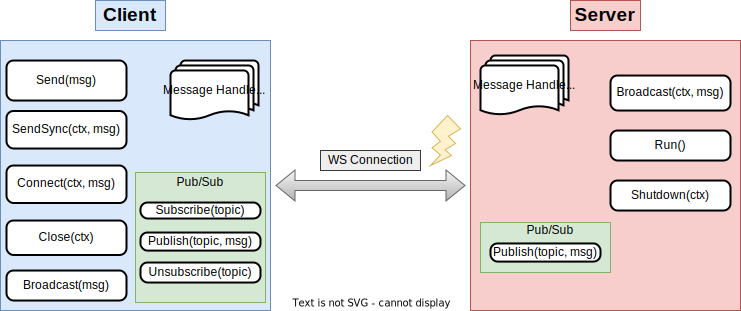
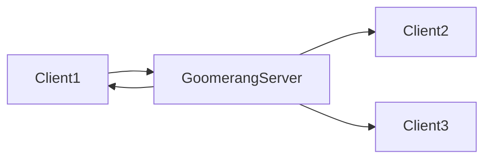
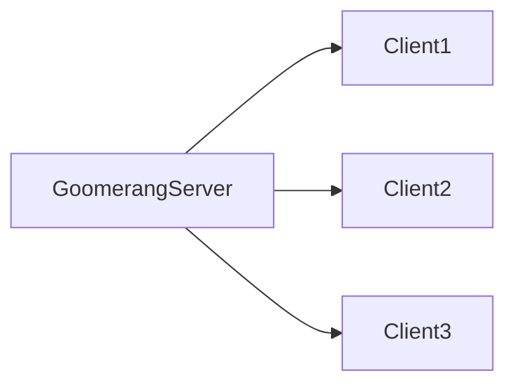
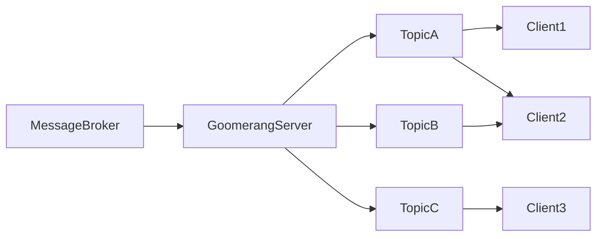

# Goomerang

A [protocol buffers](https://developers.google.com/protocol-buffers/) over [websocket](https://datatracker.ietf.org/doc/html/rfc6455)
communications library.
<br>
<br>
<p align="center">

</p>

<p align="center">
<a href="https://github.com/eloylp/goomerang/actions/workflows/ci.yml"></a>
<a href="https://goreportcard.com/report/go.eloylp.dev/goomerang"></a>
<a href="https://godoc.org/go.eloylp.dev/goomerang"></a>
</p>

<p align="right" style="color:silver">
Gopher art by <a href="https://github.com/lidiackr">@lidiackr</a>
</p>

## Status

This project is still a proof of concept. It has none or very little production experience. Maintainers of the project reserve the right of
breaking the public API in new versions.

## Motivation

Goomerang is an effort to provide an easy, application friendly way for communicating clients and servers. Because some of us only need to
send some protos over a fast pipe.



Possible status transitions for servers:


Possible status transitions for clients:


## Main features

* Simple, modular, embeddable. Use only the parts of interest. Have full control over the dependency.
* Websockets as underlying transport (currently built on top of [gorilla/websocket](https://github.com/gorilla/websocket)).
* [Protocol buffers](https://developers.google.com/protocol-buffers/) as first class citizen. Register [message handlers](#message-handlers)
  at clients and servers.
* [Middleware support](#middlewares), inspired by the Go HTTP standard lib.
* [Message Broadcasting](#broadcasts) feature.
* [Publish and subscribe](#publish-and-subscribe) model.
* Send [synchronous messages](#synchronous-sends) from the client side, following a request/response pattern.
* Support for concurrency at a message handler level.
* Support for configurable [hooks](#hooks) for certain actions.
* [Graceful shutdown](#graceful-shutdown) of the websocket connection/processing.
* [Ping/pong](https://datatracker.ietf.org/doc/html/rfc6455#section-5.5.2) messages out of the box in clients and server. Keep alive
  connections.
* Customizable TLS configuration.
* Custom errors are exposed, ability to build retry systems on top of the public API.
* [Observability tools](#observability), that will help instrumenting clients and servers.

## Installation

```bash
go get go.eloylp.dev/goomerang
```

## Basic usage

If you are unfamiliar with protocol buffers, all the examples on this readme plus a little guide can be
found [here](example/protos/README.md).

Let's create a basic server. We just need to import the server package from the library. The server has
multiple [available options](server/opts.go), we encourage the user to review them.

```go
package main

import (
	"log"

	"go.eloylp.dev/goomerang/server"
)

func main() {
	s, err := server.New(
		server.WithListenAddr("127.0.0.1:8080"),
	)
	if err != nil {
		log.Fatal(err)
	}
	if err := s.Run(); err != nil { // Will block the program till exit.
		log.Fatal(err)
	}
	//...
}
```

The client side package its quite symmetric with the server one. The client has also multiple [available options](client/opts.go), Let's
see an example:

```go
package main

import (
	"context"
	"log"

	"go.eloylp.dev/goomerang/client"
)

func main() {
	//...
	c, err := client.New(
		client.WithServerAddr("127.0.0.1:8080"),
	)
	if err != nil {
		log.Fatal(err)
	}
	if err := c.Connect(context.TODO()); err != nil {
		log.Fatal(err)
	}
	//...
}
```

That's it ! we just have connected a client and a server ! But not in a very useful way. Both, client and server have support for handlers.
See the next sections for more information.

## Messages

Goomerang facilitates the creation of custom message protocols. Messages can have 2 parts, `headers` and a `payload`. Headers are just
a `map[string]string`. The payload allows holding any type which accomplishes
the [proto.Message](https://github.com/protocolbuffers/protobuf-go/blob/v1.28.0/proto/proto.go#L24) interface, so any protocol buffer
message type.

```go
package main

import (
	"go.eloylp.dev/goomerang/message"

	"go.eloylp.dev/goomerang/example/protos"
)

func main() {
	msg := message.New().
		SetHeader("Key", "Value").
		SetPayload(&protos.MessageV1{
			Message: "my message !",
		})
}
```

It's **encouraged to use the message builder**, so all complexities and needed data will be fulfilled.

The `message.Message` type it's normally used in message handlers. It can also be used
in the public API of client and server instances for simple operations like `Send(msg)`. See more in the following documentation.

### Messages registration

Both parts, clients and servers, need to know all kind of messages they are going to receive beforehand. There are 2 ways of registering
message types:

* Using the [handler registration](#message-handlers) functions.
* In clients, the convenient `client.RegisterMessage(msg)` can be used.

**They are exclusive**. If a message is already registered in the moment of the handler registration, such message doesnt need to be
registered
by other methods.k

## A history of handlers and middlewares

There's support for handlers and middlewares for both, client and server sides. This part of the project comes inspired by the
Go [HTTP standard library](https://pkg.go.dev/net/http#HandlerFunc). The intention is to make this part familiar and versatile.

Handlers and middlewares **can only be registered before starting** the client or the server.

### Message Handlers

Let's see how to register a message handler.

```go
package main

import (
	"go.eloylp.dev/goomerang/message"
	"go.eloylp.dev/goomerang/server"
	"go.eloylp.dev/goomerang/example/protos"
)

func main() {

	// Create the server
	s, _ := server.New(server.WithListenAddr("127.0.0.1:8080"))

	// protos.MessageV1 represents a hypothetical message in your proto repo.
	s.Handle(&protos.MessageV1{}, message.HandlerFunc(func(sender message.Sender, msg *message.Message) {
		// We need to cast the message, from the proto interface, to the concrete message type.
		msgT := msg.Payload.(*protos.MessageV1)

		// Do whatever with your message,
		// your handling logic goes here.

		// Alternatively, reply with another message.
		payload := &protos.ReplyV1{}
		reply := message.New().
			SetPayload(payload).
			SetHeader("status", "200")

		_, err := sender.Send(reply) // Replies to the client connection.
		// check for errors ...
	}))
}
```

Symmetrically, the same handler registering signature can be found at the client public API.

As handlers only need to accomplish the `message.Handler` interface, It's very common to use structs for holding handler dependencies,
which need to be thread safe:

```go
package main

import (
	"database/sql"

	"go.eloylp.dev/goomerang/message"
)

type Handler struct {
	DB *sql.DB
}

func (m *Handler) Handle(sender message.Sender, msg *message.Message) {
	//  handling logic goes there.
}
```

### Middlewares

Middlewares are just message handlers that always get executed no matter the kind of message, alternatively providing the ability to execute
the next
handler in the chain. They are executed just before the message handler, bringing the opportunity to add preprocessing or postprocessing
logic to the message handling operation. i.e metrics, logging or panic handlers. Let's see how to register a middleware:

```go
package main

import (
	"fmt"

	"go.eloylp.dev/goomerang/message"
	"go.eloylp.dev/goomerang/server"
)

func main() {
	s, _ := server.New(server.WithListenAddr("127.0.0.1:8080"))
	s.Middleware(func(h message.Handler) message.Handler {
		return message.HandlerFunc(func(sender message.Sender, msg *message.Message) {
			fmt.Printf("received message of kind: %q", msg.Metadata.Kind)
			h.Handle(sender, msg) // Continue with the next handler in chain.
		})
	})
}
```

That's sounds really familiar ! Yes, Goomerang tries to preserve same aspects of the standard library. Again, the same symmetric interface
can be found in the client public API.

It's important to note that **any number of middlewares can be registered**. The **order of registration will drive the order of execution**
. So for example, if we had:

```go
package main

import (
	"go.eloylp.dev/goomerang/message"
	"go.eloylp.dev/goomerang/server"
)

func main() {
	s, _ := server.New(server.WithListenAddr("127.0.0.1:8080"))
	s.Handle(Handler())
	s.Middleware(Middleware1())
	s.Middleware(Middleware2())
}
```

The order of execution would be:


This library facilitates some middleware [implementations](middleware) that could be used directly by library users. Let's see the example
of the panic
handler one:

```go
package main

import (
	"fmt"

	"go.eloylp.dev/goomerang/message"
	"go.eloylp.dev/goomerang/middleware"
	"go.eloylp.dev/goomerang/server"
)

func main() {
	s, _ := server.New(server.WithListenAddr("127.0.0.1:8080"))
	s.Middleware(middleware.Panic(func(p interface{}) {
		fmt.Printf("panic detected: %v", p)
	}))
}
```

As a rule of thumb, its recommended to implement the panic middleware as first in the chain (so it protects the rest of handlers), in
order to not crash the entire process if a panic arises at some point in the handler chain.

## Broadcasts

This library allows sending a message to all connected clients via the broadcast interface. This interfaces can be found in both
implementations, the client and the server.

From the client side perspective, the only thing to do is to call the `c.Broadcast(msg)` method:

```go
package main

import (
	"context"
	"log"

	"go.eloylp.dev/goomerang/client"
	"go.eloylp.dev/goomerang/example/protos"
	"go.eloylp.dev/goomerang/message"
)

func main() {
	//...
	c, err := client.New(
		client.WithServerAddr("127.0.0.1:8080"),
	)
	if err != nil {
		log.Fatal(err)
	}
	if err := c.Connect(context.TODO()); err != nil {
		log.Fatal(err)
	}
	msg := message.New().SetPayload(&protos.MessageV1{
		Message: "my message !",
	})
	if _, err := c.Broadcast(msg); err != nil {
		log.Fatal(err)
	}
}
```

The above call to `c.Broadcast(msg)` sends a command to the server which will send the message to all connected clients. That means
the message being broadcasted needs to be be properly [registered](#messages-registration) in all peers.



From the server side perspective, it's also possible to send a message to all connected clients. This can be useful for a number of cases,
like
push notifications. Here's and example on how to do it:

```go
package main

import (
	"context"
	"log"

	"go.eloylp.dev/goomerang/example/protos"
	"go.eloylp.dev/goomerang/message"
	"go.eloylp.dev/goomerang/server"
)

func main() {
	s, _ := server.New(server.WithListenAddr("127.0.0.1:8080"))

	msg := message.New().SetPayload(&protos.MessageV1{
		Message: "a message for everyone !",
	})

	_, err := s.BroadCast(context.TODO(), msg)
	if err != nil {
		log.Fatal(err)
	}
}
```

In contrast with client side broadcasts, server side broadcasts will start the broadcasting operation immediately.



## Publish and subscribe

Clients can send asynchronous messages among them by publishing and subscribing to topics. Currently, **each topic will conform a diffusion
domain**, which
means that any message published in a given topic will be sent to all subscribed clients, without taking place any kind of load balancing.

On the client side, all messages intended to be received by a subscription, should be properly [handled](#message-handlers).

The server must be aware of all message kinds going through the
pub/sub system. See [message registration](#messages-registration) for more details.

Let's check and example of the client side API:

```go
package main

import (
	"context"
	"log"

	"go.eloylp.dev/goomerang/client"
	"go.eloylp.dev/goomerang/example/protos"
	"go.eloylp.dev/goomerang/message"
)

func main() {
	//...
	c, err := client.New(
		client.WithServerAddr("127.0.0.1:8080"),
	)
	if err != nil {
		log.Fatal(err)
	}
	if err := c.Connect(context.TODO()); err != nil {
		log.Fatal(err)
	}

	// Client subscribes to a topic. Now it will receive all messages
	// for that topic.
	if err := c.Subscribe("topic.a"); err != nil {
		log.Fatal(err)
	}

	// At any moment, any client can publish a message to a specific topic.
	msg := message.New().SetPayload(&protos.MessageV1{})
	if _, err := c.Publish("topic.a", msg); err != nil {
		log.Fatal(err)
	}
	// Finally, client can unsubscribe from a topic at any moment, the
	// client will stop receiving messages for that topic.
	if err := c.Unsubscribe("topic.a"); err != nil {
		log.Fatal(err)
	}
}
```

We can appreciate the `Subscribe(topic string)`, `Publish(topic string, msg *message.Message)` and `Unsubscribe(topic string)` interfaces.
This three calls will send a command to the server. After that the server will accomplish the required operation.

From the server side API, there's also a method `Publish(topic string, msg *message.Message)`:

```go
package main

import (
	"context"
	"log"

	"go.eloylp.dev/goomerang/message"
	"go.eloylp.dev/goomerang/server"
	"go.eloylp.dev/goomerang/example/protos"
)

func main() {
	// Create the server
	s, _ := server.New(server.WithListenAddr("127.0.0.1:8080"))

	msg := message.New().SetPayload(&protos.MessageV1{
		Message: "a message for everyone !",
	})
	// Once clients are connected, server can start sending messages
	// to specific topics.
	if err := s.Publish("topic.a", msg); err != nil {
		log.Fatal(err)
	}
}
```

A typical use case for server side publications , would be to consume from a queue and fan out the messages to the different topics, in
which
clients would be
subscribed.



(Graph of Message flow)

The **internal state** of the pub/sub engine its **not replicated across server replicas**. That means the server can't scale out
horizontally yet.

## Synchronous sends

The default send methods `c.Send()` `s.Broadcast()` from client and server respectively, **are completely asynchronous**. They work as a
"fire and forget" send system. That means the user of the library should design a way to ensure the message was received and processed by
the server before removing it from its internal state. Unless of course, the intrinsic value of the data expires very quick and the client
can afford its lost.

In response to this issue, clients on this library have a `c.SyncSend(ctx, msg)` method implemented. This allows clients sending messages
and wait for the server reply.

Here is an example of its use:

```go
package main

import (
	"context"
	"log"

	"go.eloylp.dev/goomerang/client"
	"go.eloylp.dev/goomerang/message"
	"go.eloylp.dev/goomerang/example/protos"
)

func main() {
	c, err := client.New(client.WithServerAddr("127.0.0.1:8080"))
	if err != nil {
		log.Fatal(err)
	}
	// The client needs to be aware of the reply messages 
	// beforehand. 
	c.RegisterMessage(&protos.SuccessReplyV1{})
	c.RegisterMessage(&protos.BadReplyV1{})

	msg := message.New().SetPayload(&protos.MessageV1{})
	// Will block till reply from the server is received or
	// the context is cancelled.
	_, respProto, err := c.SendSync(context.TODO(), msg)
	if err != nil {
		log.Fatal(err)
	}

	if respProto.GetHeader("status") != "OK" {
		resp := respProto.Payload.(*protos.BadReplyV1)
		// Do something with the bad reply
		return
	}
	resp := respProto.Payload.(*protos.SuccessReplyV1)
	// Do something with the success reply
}
```

This is just a high level request/response pattern built on the top of the "fire and forget"
previously commented send system. It probably can be useful some users, when the reply is
crucial for completing the operation. Remember we are sharing the same pipe here, for all the messages.

### Some extra notes

Asynchronous methods just write to the TCP socket send buffer. They are only going to block the call if the other peer stops ACKing
TCP packets, so the pre-negotiated TCP window size is exceeded. That way the sender knows when to stop sending messages to the other peer,
until it starts performing more TCP acks again.

The following command can give us minimum, default and maximum receive buffers size in bytes in a Linux machine.

```bash
$ cat /proc/sys/net/ipv4/tcp_rmem 
4096	131072	6291456
```

## Hooks

Sometimes getting feedback from internal parts of the system its difficult. Specially in processing loops, where in case of errors we cannot
return them to the user, and we do not want to make decisions on their place. To deal with this,
in both parts (client and server) the user can register function hooks. A complete list of them can be found in the configuration options of
both, [client](client/opts.go) and [server](server/opts.go). Let's take a look on how to register an error hook:

```go
package main

import (
	"log"

	"go.eloylp.dev/goomerang/server"
)

func main() {
	s, _ := server.New(
		server.WithListenAddr("127.0.0.1:8080"),
		server.WithOnErrorHook(func(err error) {
			log.Printf("logging error: %v", err)
		}),
		server.WithOnErrorHook(func(err error) {
			// Do a second action with err.
		}),
	)
}
```

This error hooks are very handy to log errors, so the user can use custom loggers/metrics registries. All the hooks can be
registered multiple times. The logic behind will just execute the hooks in order.

## Graceful shutdown

The current implementation supports a graceful shutdown
as described
in [RFC6455](https://datatracker.ietf.org/doc/html/rfc6455#section-1.4). One side of the connections initiates the shutdown procedure,
signaling it's not going to send more messages and waiting for the same reply from the other peer. Once all processing logic (like message
handlers)
end, the library just returns the control to the user. This implementation works in a best-effort way, as many things can go wrong in the
middle of the process. Users of the library are encouraged to not rely on this shutdown procedure regarding data integrity.

Let's see the shutdown sequence when a **client initiates** the shutdown procedure:


The server never changes its status, as the initiator of the shutdown was only one client. So only the "connection slot" and processing for
that client is removed from the server.

Let's check now the sequence when the **server initiates** the shutdown connection:


## Observability

### Prometheus metrics

By default, this library assumes no metrics. However, it provides tools for a quick instrumentation with
[Prometheus](https://prometheus.io/) metrics for both, [clients](metrics/client.go) and [servers](metrics/server.go). Let's see an
example of a metered client:

```go
package main

import (
	"log"

	"github.com/prometheus/client_golang/prometheus"

	"go.eloylp.dev/goomerang/client"
	"go.eloylp.dev/goomerang/metrics"
)

func main() {
	// Metrics creation, with the default config.
	m := metrics.NewClientMetrics(metrics.DefaultClientConfig())

	// Register the metrics in Prometheus registry. This time, the global one.
	m.Register(prometheus.DefaultRegisterer)

	// Use the same options as in a normal client constructor.
	c, err := client.NewMetered(m,
		client.WithServerAddr("127.0.0.1:9090"),
		client.WithMaxConcurrency(5),
		// ...
	)
	if err != nil {
		log.Fatal(err)
	}
	// ...
}
```

Note in the above example, the `client.NewMetered(...)` accepts as second argument the same type of [options](client/opts.go) exposed in the
[basic example](#basic-usage).

As commented in the [middleware section](#middlewares), the user also has access to all low level observability middlewares in
the [middleware package](middleware). Its encouraged for users to take a look there in case further customization its needed.

The same, symmetric interface can be found in the server public API.

### Grafana dashboard


This library provides an
out-of-the-box [Grafana](https://grafana.com/) [dashboard](internal/lab/grafana/provisioning/dashboards/goomerang.json) which should cover
the
basic usage. Users of the library are encouraged to adapt it at discretion.

## Contributing

Contributions are welcome ! If you think something could be improved, request a new feature or just want to leave some feedback,
please check our [contributing](CONTRIBUTING.md) guide. 