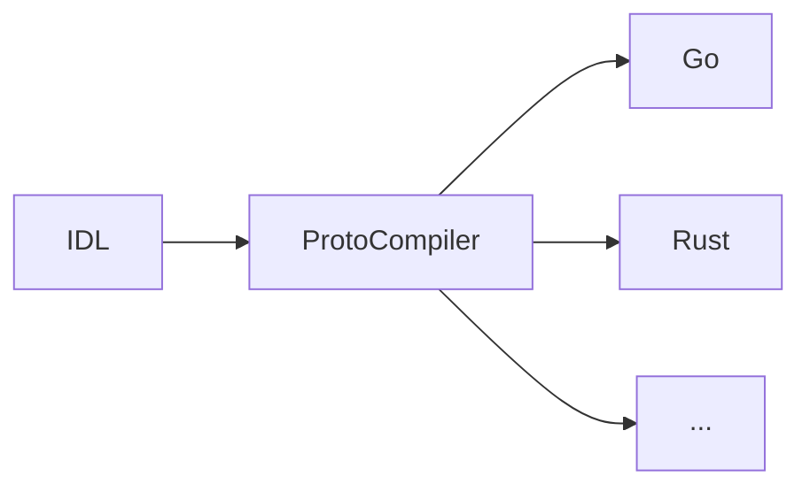

## The protocol buffer repository example

This is a quick
intro into how to create and maintain a [protocol buffer](https://developers.google.com/protocol-buffers/) repository.

The Goomerang library assumes the user has a protocol buffers repository, which is shared by client and servers. That guarantees the types
exchanged by client and servers are 100% compatibles at a binary level.

Protocol buffers works with an [IDL](https://en.wikipedia.org/wiki/Interface_description_language) (Interface definition language) which
then it's converted for the relevant target languages:

The first thing the user needs to do is to download and install
the proto [compiler](https://github.com/protocolbuffers/protobuf#protocol-compiler-installation) .

Then create the IDLs. The protos found in the [README.md](../../README.md) examples, can be found on this repo [IDL](examples.proto).

Once we have the IDLs ready, we can use the protocol buffer compiler for generating the resultant code that should be shared with clients
and servers. An example on this repo [Makefile](Makefile) is provided.
