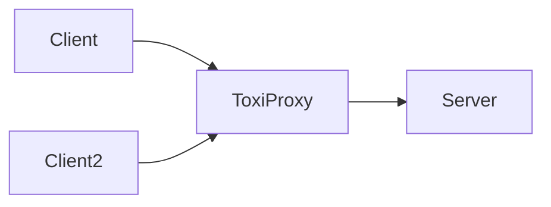

## Goomerang lab

Welcome to the Goomerang lab ! 🔬

This part of the project provides a playground for developers, in which they can:

* Test the software interfaces as a true user point of view.
* See metrics of the `go runtime` and `Goomerang` dashboards.
* Make performance studies with Go [pprof](https://pkg.go.dev/net/http/pprof).
* Simulate network errors with the help of [ToxiProxy](https://github.com/Shopify/toxiproxy).

The lab is based on [docker compose file](docker-compose.yml), which will bring up the following scheme:



It's completely up to the developer to tweak the above schema at discretion. Let's just try to only commit final states.

In order to bring up the environment just:

```bash
$ make up
## After some verbose output ...
Grafana access at: http://localhost:3000
Prometheus access at: http://localhost:3000
Server pprof access at: http://localhost:6060/debug/pprof
Client pprof access at: http://localhost:6061/debug/pprof
```
Use the provided URLs to access each component.

Check the [Makefile](Makefile) for more make targets on how to manage the lab lifecycle.

Enjoy ! 🤓